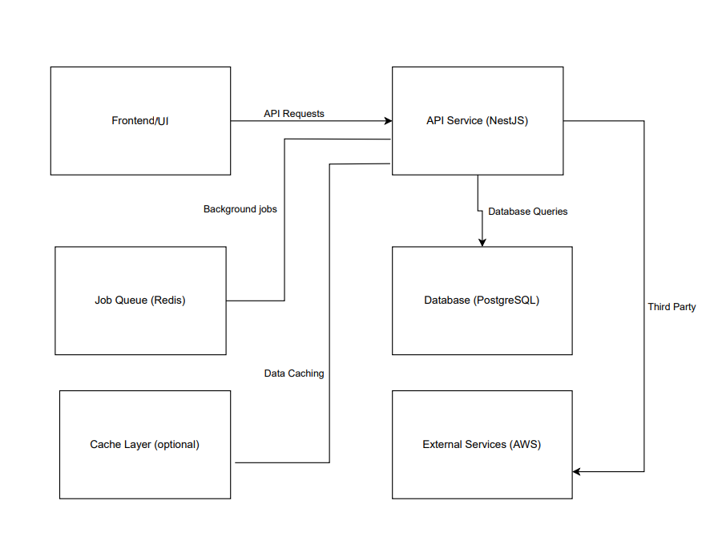

# Booking Service

A backend service for managing provider availability and appointment bookings.

## Setup Instructions

### 1. Clone the repository and set up environment variables

Copy the example environment file:

- `cp .env.example .env`
- `cp .env.test.example .env.test`

- Make any necessary adjustments in .env and .env.test for your local setup.

### 2. Install dependencies

- ` npm install`

### 3. Generate prisma client

- `npx prisma generate`

### 4. Start the application with Docker

- ` docker-compose up --build`

- This will spin up the development and test databases and the application container.

### 5. Run Prisma migrations

- For development environment:

- `npx prisma migrate dev`

- For test environment:

- `npm run migrate:test`

### 6. Run tests

- `npm run test`

## Design Choices

### Language/Framework:

- Chose Node.js with NestJS for its modular architecture and support for scalable applications. TypeScript is used for type safety and maintainability.

### Database:

- PostgreSQL was selected due to its reliability, ACID compliance, and support for complex queries. The schema design optimizes for appointment scheduling with relationships between providers, appointments, and schedules.

### Concurrency Control:

- Optimistic concurrency control is employed to handle simultaneous requests for appointment bookings, ensuring data integrity even under high load.

### State Management:

- State is managed in the database using relational tables, ensuring persistence and avoiding in-memory limitations.

### Trade-offs:

- Chose simplicity and maintainability over ultra-low latency in this iteration. Horizontal scaling via database partitioning is considered for future growth.

## Scalability Considerations

- Efficient Data Access: The PostgreSQL schema is normalized, and relationships are properly structured to minimize data redundancy. Indexing on providerId, startTime, and status in the Appointment model will improve query performance as the data volume grows.

- Service Modularity: The codebase follows a modular structure using NestJS modules (e.g., provider, appointment), making it easier to isolate and scale specific domains independently (e.g., moving provider management to a separate microservice if needed).

- Event Readiness: Although events are currently handled in-process, the architecture anticipates an event-driven model that can emit booking events to other services (e.g., for notifications, audit logging, analytics).

- Future scalability can be enhanced by leveraging container orchestration (Kubernetes) and auto-scaling based on traffic.

## API Routes

### Providers

- POST `/api/providers`: Creates a new provider.

- POST `/api/providers/:providerId/schedule`: Update the provider's weekly schedule.

- GET `/api/providers/:providerId/availability?date=YYYY-MM-DD`:
  Retrieve available appointment slots for a provider on a given date.

### Appointments

- GET `/api/appointments/:appointmentId` : Retrieve a specific appointment by ID.

- POST `/api/appointments` : Creates a new appointment.

- PUT `/api/appointments/:appointmentId` : Reschedule an existing appointment..

- DELETE `/api/appointments/:appointmentId` : Cancel an existing appointment.

## System Diagram

